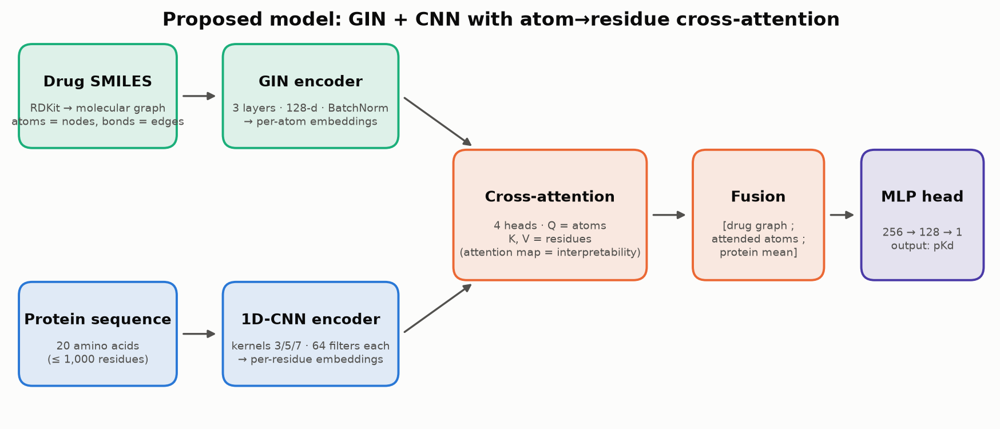
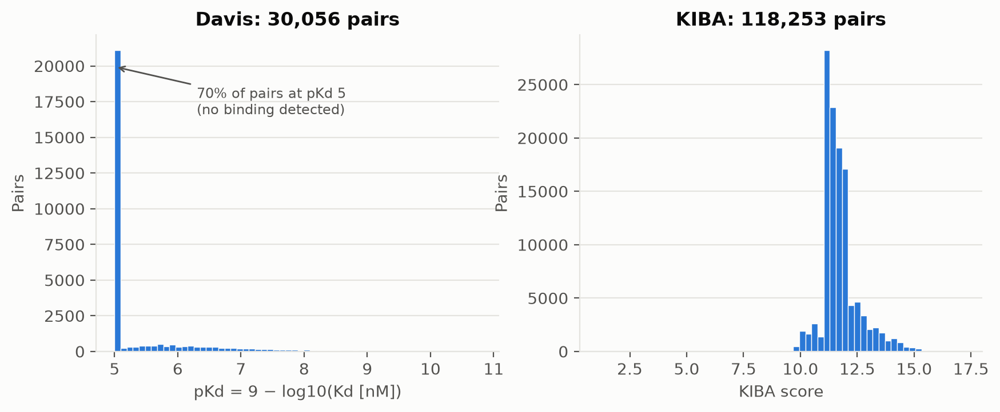
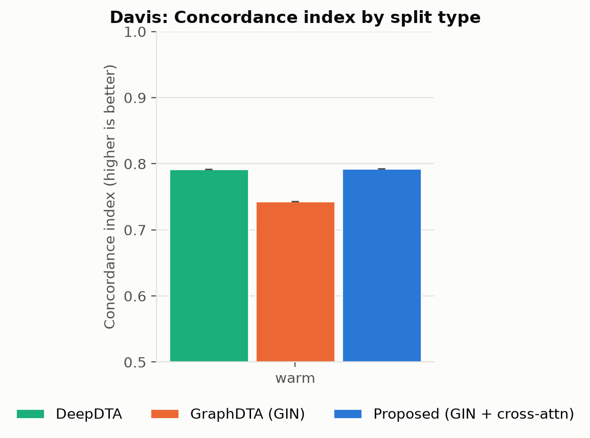
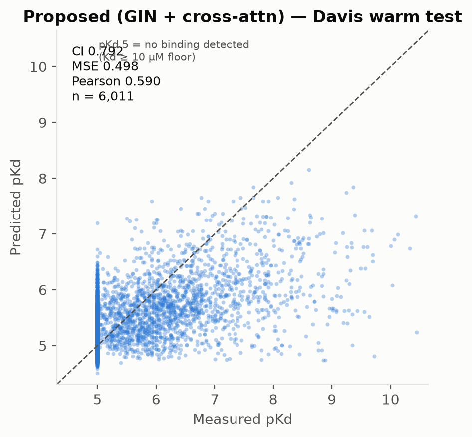
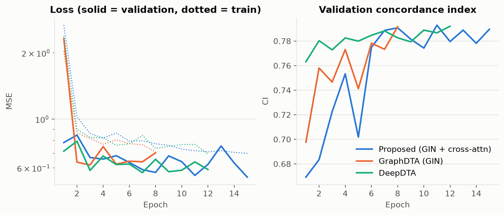
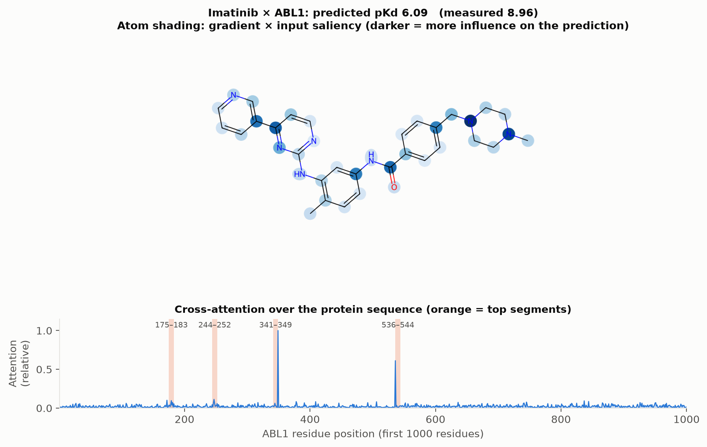

# AffiniGraph — Graph Neural Networks for Drug–Target Interaction Prediction

Predicting **how strongly a drug molecule binds to a protein target** from just its chemical
structure (SMILES) and the protein's amino-acid sequence, using a **Graph Neural Network with
atom-to-residue cross-attention** — plus a web application that serves the trained model with
interpretable outputs.

<p align="center">
  
</p>

---

## Contents

1. [Problem & motivation](#1-problem--motivation)
2. [What this project delivers](#2-what-this-project-delivers)
3. [Datasets](#3-datasets)
4. [Data processing pipeline](#4-data-processing-pipeline)
5. [Evaluation protocol: data splits](#5-evaluation-protocol-data-splits)
6. [Models](#6-models)
7. [Training](#7-training)
8. [Metrics](#8-metrics)
9. [Results](#9-results)
10. [Interpretability](#10-interpretability)
11. [The web application](#11-the-web-application)
12. [REST API](#12-rest-api)
13. [Quick start](#13-quick-start)
14. [Reproducing every number](#14-reproducing-every-number)
15. [Project structure](#15-project-structure)
16. [Engineering notes (correctness & performance work)](#16-engineering-notes-correctness--performance-work)
17. [Testing](#17-testing)
18. [Limitations & honest caveats](#18-limitations--honest-caveats)
19. [Future work](#19-future-work)
20. [Suggested presentation outline](#20-suggested-presentation-outline)
21. [References](#21-references)

---

## 1. Problem & motivation

* Bringing a new drug to market takes **10–15 years and USD 1–3 billion**; most candidates fail.
* An early, expensive step is finding which molecules bind a disease-relevant protein.
  Wet-lab assays measure one pair at a time.
* **Drug–target interaction (DTI) prediction** ranks candidate molecules computationally so
  that only the most promising pairs go to the lab (virtual screening, drug repurposing,
  off-target / side-effect checks).

**Task (regression).** Given a drug (SMILES string) and a target protein (amino-acid sequence),
predict the binding affinity as **pKd = −log10(Kd / 1 M)**. Higher pKd = tighter binding:

| pKd | Kd | Meaning |
|---|---|---|
| ≥ 8 | ≤ 10 nM | strong binder (typical approved kinase inhibitor on its target) |
| 6 – 8 | 10 nM – 1 µM | moderate binder |
| 5.5 – 6 | 1 – 3 µM | weak binder |
| ≈ 5 | ≥ 10 µM | no measurable binding (Davis assay floor) |

**Why graphs?** A molecule *is* a graph: atoms are nodes, bonds are edges. A GNN learns from
the real chemical structure instead of from a text string, and is invariant to how the SMILES
happens to be written.

**Why cross-attention?** Instead of squeezing drug and protein into one vector each and
concatenating them, every atom of the drug *attends* over every residue of the protein. The
model learns which parts of the drug relate to which parts of the protein — and those
attention weights can be shown to the user.

---

## 2. What this project delivers

| Component | Description |
|---|---|
| **Research codebase** (`src/`) | Data download/featurisation, leakage-safe splits, 6 model variants, training harness, metrics, interpretability, inference |
| **Benchmark experiments** (`experiments/`) | Proposed model vs. DeepDTA and GraphDTA-GIN on Davis (warm split); scripts for all splits, ablations and multi-seed runs |
| **Paper artefacts** (`paper/`) | Auto-generated LaTeX tables, Markdown summary and figures |
| **Web app** (`frontend/` + `scripts/serve_app.py`) | Dashboard, live prediction with uncertainty and explanations, attention map, results browser, learning pages |
| **REST API** | JSON endpoints for prediction, model info, example molecules, dataset stats |
| **Tests** (`tests/`, 67 tests) | Metrics vs. brute-force definitions, leakage checks, model invariants, inference and API end-to-end |

Tech stack: **Python 3.12, PyTorch 2.5, PyTorch Geometric 2.6, RDKit 2024.03, NumPy/pandas/SciPy,
scikit-learn, matplotlib**; frontend in plain **HTML/CSS/JavaScript** (no build step);
server on the Python standard library (`http.server`).

---

## 3. Datasets

Both are the standard benchmark releases from DeepDTA (Öztürk et al., 2018), already in
`data/raw/` (downloadable with `src/data/download.py`).

| | **Davis** | **KIBA** |
|---|---|---|
| Source | Davis et al., *Nat. Biotechnol.* 2011 | Tang et al., *J. Chem. Inf. Model.* 2014 |
| Measurement | Kd (dissociation constant) | KIBA score (integrates Ki, Kd, IC50) |
| Drugs | 68 kinase inhibitors | 2,111 |
| Targets | 442 kinases (incl. mutants) | 229 kinases |
| Pairs used | **30,056** (complete 68 × 442 matrix) | **118,253** |
| Label | pKd = 9 − log10(Kd[nM]) | KIBA score as given |
| Label range | 5.00 – 10.80 (mean 5.45 ± 0.89) | 1.10 – 17.20 (mean 11.72 ± 0.84) |
| Protein length | median 707, max 2,549 (115 > 1,000) | median 620, max 4,128 |
| Atoms per drug | median 31, max 46 | median 27, max 268 |

<p align="center"></p>

**Important property of Davis:** about **70 % of all pairs sit exactly at pKd = 5** — the assay's
"no binding detected (Kd ≥ 10 µM)" floor. A model that always predicts ~5.4 already gets a low
MSE, which is why ranking metrics (CI) and correlation are reported next to MSE, and why the
scatter plots show a dense column at x = 5.

KIBA's provided matrix contains one pair with score 0 that the loader drops as missing, giving
118,253 rather than the often-quoted 118,254 pairs.

---

## 4. Data processing pipeline

```
SMILES ──RDKit──▶ molecular graph ──▶ atom features (38-d one-hot) + bond list (+10-d bond features)
protein sequence ─────────────────▶ integer tokens (0 = padding, 1–20 amino acids, 21 = unknown)
Kd (nM) ──────────────────────────▶ pKd = 9 − log10(Kd)
```

**Atom features (38 dims, one-hot):** element (C, N, O, S, F, Cl, Br, I, P, Si, B, Na, K, other),
degree (0–5), formal charge (−2…+2), number of hydrogens (0–4), hybridisation (SP…SP3D2, other),
aromatic (y/n), in ring (y/n).
**Bond features (10 dims):** bond type (single/double/triple/aromatic), conjugated, in ring, stereo.
**Proteins:** truncated to 1,000 residues (as in GraphDTA); batches are padded only to their
longest sequence.

Implementation: `src/data/featurization.py`, `src/data/download.py`, `src/data/dataset.py`.

---

## 5. Evaluation protocol: data splits

Random ("warm") splits are the classic benchmark but are optimistic: every test drug and test
protein was also seen in training. To measure *generalisation*, four split types are
implemented (70 % train / 10 % validation / 20 % test), each with an assertion that **fails
loudly if any test drug/target leaks into training**:

| Split | What is held out | Real-world question | Davis train / val / test pairs |
|---|---|---|---|
| **Warm** | random pairs | fill gaps in a known matrix | 21,040 / 3,005 / 6,011 |
| **Cold drug** | 20 % of drugs (13 of 68) | new molecule vs. known targets | 21,658 / 2,652 / 5,746 |
| **Cold target** | 20 % of proteins (88 of 442) | known drugs vs. a new target | 21,080 / 2,992 / 5,984 |
| **Cold both** | unseen drugs **and** proteins | completely novel pairs (hardest) | 15,190 / 264 / 1,144 |

(Split sizes for seed 42; `src/data/splits.py`, leakage tests in `tests/test_data.py`.)

---

## 6. Models

All models share the same data pipeline, training loop and metrics, so comparisons are fair.

| Model (`--model`) | Drug encoder | Protein encoder | Fusion | Params |
|---|---|---|---|---|
| `deepdta` (Öztürk 2018) | CNN over SMILES characters | CNN (kernels 4/8/12) | concatenate → MLP | 307 k |
| `graphdta_gcn` (Nguyen 2021) | 3-layer GCN | CNN | concatenate → MLP | 284 k |
| `graphdta_gat` | 3-layer GAT (4 heads) | CNN | concatenate → MLP | 435 k |
| `graphdta_gin` | 3-layer GIN | CNN | concatenate → MLP | 432 k |
| **`proposed`** | 3-layer GIN, per-atom embeddings | multi-kernel CNN, per-residue embeddings | **cross-attention** atoms → residues | 569 k |
| `proposed_concat` (ablation) | same as proposed | same as proposed | concatenate (no attention) | 470 k |

### The proposed model in detail (`src/models/proposed.py`)

1. **Drug encoder — GIN** (`DrugGNNEncoderWithAtoms`): linear projection 38 → 128, then 3 Graph
   Isomorphism Network layers (MLP 128 → 256 → 128, BatchNorm, ReLU, dropout). Output: a
   128-d embedding *per atom* and a mean-pooled molecule embedding. GIN is as expressive as
   the Weisfeiler-Lehman graph-isomorphism test, the strongest of the standard message-passing GNNs.
2. **Protein encoder — multi-kernel 1D-CNN** (`ProteinCNNEncoderWithResidues`): amino-acid
   embedding (128-d) → three parallel convolutions with kernel sizes 3, 5, 7 (64 filters each,
   capturing motifs of different lengths) → projection to 128-d *per residue*.
3. **Cross-attention fusion** (`DrugProteinCrossAttention`): 4-head scaled dot-product
   attention with **queries = drug atoms, keys/values = protein residues** (padding masked).
   Each atom gathers a summary of the protein regions relevant to it.
4. **Fusion vector:** `[molecule embedding ; mean of attended atom vectors ; mean protein embedding]`
   → linear → 128-d.
5. **Prediction head:** MLP 128 → 256 → 128 → 1 (ReLU, dropout 0.1) → **pKd**.

The CNN protein encoder is used by default; an **ESM-2** pre-trained protein-language-model
encoder is implemented behind `protein_encoder_type="esm"` (needs `fair-esm` and precomputed
embeddings) but was not used in the reported runs.
`src/models/enhanced_model.py` contains an experimental larger variant (bidirectional attention,
Transformer protein encoder, uncertainty head) that is not part of the benchmark.

---

## 7. Training

| Setting | Value |
|---|---|
| Loss | mean squared error on pKd |
| Optimiser | AdamW, learning rate 1e-3, weight decay 1e-5 |
| Batch size | 128 pairs |
| LR schedule | ReduceLROnPlateau on validation loss (×0.5) |
| Early stopping | on validation loss; best checkpoint restored |
| Gradient clipping | max norm 5 |
| Dropout | 0.1 |
| Seeds | Python/NumPy/PyTorch seeded, deterministic algorithms enabled |
| Hardware | 4-core laptop CPU, no GPU |
| Budget (`cpu` plan) | seed 42, ≤ 15 epochs, early-stopping patience 5, LR patience 3 |

Every run writes `results.json` (config, config hash, git commit, split sizes, full training
history, test metrics), `model.pt` (weights + everything needed to rebuild the model),
`predictions.npz` (test-set predictions) and `config.yaml`.

---

## 8. Metrics

| Metric | Definition | Good value | Why |
|---|---|---|---|
| **MSE / RMSE** | mean (squared) error in pKd units | lower | accuracy of the number |
| **CI** (concordance index) | fraction of pairs whose *order* is predicted correctly (ties = ½) | 0.5 random → 1.0 perfect | ranking is what virtual screening needs |
| **r²ₘ** (Roy et al.) | r² · (1 − √\|r² − r₀²\|) | > 0.5 acceptable | penalises predictions that correlate but sit off the y = x line |
| Pearson / Spearman | linear / rank correlation | higher | |

CI and r²ₘ were re-implemented from their published definitions and are unit-tested against
brute-force reference implementations (`tests/test_metrics.py`).

---

## 9. Results

All numbers below are on the **Davis test set (warm split, 6,011 pairs never used for training
or model selection), seed 42**, trained on a 4-core CPU with at most 15 epochs
(`python scripts/train_all.py`). Full tables: `paper/tables/results_summary.md` and the LaTeX
versions in `paper/tables/`.

| Model | Params | Epochs (early stop) | Train time | **CI ↑** | **MSE ↓** | RMSE ↓ | **r²ₘ ↑** | Pearson ↑ | Spearman ↑ |
|---|---|---|---|---|---|---|---|---|---|
| DeepDTA | 307 k | 12 | 6.6 min | 0.792 | 0.516 | 0.718 | 0.307 | 0.564 | 0.538 |
| GraphDTA (GIN) | 432 k | 8 | 4.0 min | 0.743 | 0.581 | 0.762 | 0.222 | 0.482 | 0.453 |
| **Proposed (GIN + cross-attention)** | 569 k | 15 | 13.4 min | **0.792** | **0.498** | **0.706** | **0.348** | **0.590** | **0.539** |

**Reading the results**

* The proposed model has the **lowest error (MSE 0.498)** and the **highest r²ₘ, Pearson and
  Spearman**. On ranking (CI) it ties DeepDTA (0.7925 vs. 0.7918).
* Replacing concatenation with **atom→residue cross-attention** improves on the same GIN drug
  encoder used by GraphDTA by **+0.049 CI** and **−0.083 MSE** (−14 %).
* GraphDTA-GIN early-stopped after 8 epochs; with the ~1,000-epoch GPU budget of the original
  paper it reaches CI ≈ 0.89 / MSE ≈ 0.23. **All three models here are under-trained** relative
  to the literature, so compare them with each other, not with published numbers.
* Single seed, warm split only: the differences are indicative, not statistically established
  (see §18 for how to run seeds and cold splits).

<p align="center">
  
  
</p>

<p align="center"></p>

The scatter shows the typical Davis picture: a dense column of non-binders at measured pKd = 5
and a model that ranks binders above non-binders but **compresses strong binders toward the
mean** (e.g. Imatinib × ABL1 is predicted at pKd 6.1 vs. measured 9.0). Longer training and
more seeds are the first things to improve (§19).

---

## 10. Interpretability

For every prediction the model explains itself in two ways:

* **Atom saliency** — gradient × input of the predicted pKd with respect to each atom's
  features (averaged over the ensemble): which atoms change the prediction most.
* **Protein attention** — the cross-attention weights averaged over heads and atoms: which
  protein segments the drug's atoms attend to. The four highest-attention 9-residue windows
  are reported as "top regions".

<p align="center"></p>

These are *hypotheses about what the model uses*, not a docked 3-D binding pose — attention is
learned from affinity labels alone, with no structural supervision.

---

## 11. The web application

Start with `python scripts/serve_app.py` and open <http://localhost:8000>.

| Page | What it shows |
|---|---|
| **Dashboard** | Dataset size, headline CI of the proposed model, best results table, quick actions |
| **Predict Interaction** | Enter a SMILES + protein sequence (or click a Davis drug / kinase example). Returns predicted **pKd ± ensemble std**, **Kd**, the **measured Davis value** when the pair is in the dataset, a **confidence** score, **atom saliency chips**, a **protein attention strip** with top regions, **RDKit molecular properties** (MW, LogP, HBD/HBA, TPSA, QED, Lipinski), and **rule-based ADMET flags** |
| **Simulation** | Interaction map drawn from the prediction: drug atoms coloured by saliency, top-attention protein segments, line width = attention |
| **Results** | Every trained configuration: mean ± std over seeds, filter by dataset, sort by CI / RMSE / Pearson |
| **How It Works** | Pipeline, architecture and metrics explained for non-experts, with the live scores |
| **Glossary** | Searchable definitions (SMILES, pKd, GNN, cross-attention, CI, cold split, ADMET, …) |
| **Datasets** | Dataset cards and the four split strategies |

**Where the numbers come from.** Predictions use the **proposed model trained on the Davis warm
split** (`models/serving/*.pt`). Every checkpoint in that folder is loaded as an ensemble: after
`python scripts/train_all.py --plan cpu_extended` there are 3 seeds and the UI also shows the
ensemble standard deviation as uncertainty. The confidence score combines ensemble agreement with
how similar the query drug is to the 68 training drugs (max Tanimoto similarity on Morgan
fingerprints) — it is a ranking aid, not a calibrated probability. If the server is not running
or no model is found, the UI says so explicitly and shows a clearly-labelled rough heuristic
instead.

**Measured values.** In the DeepDTA release of Davis, several targets share one sequence (e.g.
ABL1, ABL1p and 13 ABL1 mutants). When you pick a kinase from the example buttons the app sends
its Davis id and shows that entry's measurement (Imatinib × ABL1 = 8.96); for a pasted sequence
shared by several entries it shows the range instead of a single number.

**Applicability domain.** The model was trained on kinase inhibitors against kinases. The UI
warns when the drug is far from the training chemistry or the protein is not a Davis kinase.

---

## 12. REST API

| Method | Path | Body / response |
|---|---|---|
| GET | `/api/health` | `{status, model_loaded, model_error}` |
| GET | `/api/model` | ensemble size, seeds, parameter count, test metrics (mean/std) |
| GET | `/api/examples` | Davis example drugs (name, SMILES) and kinases (name, sequence) |
| GET | `/api/datasets` | pair / drug / target counts and label ranges computed from the data on disk |
| POST | `/api/predict` | `{"smiles": "...", "protein_sequence": "..."}` → prediction, explanation, properties, ADMET, notes |

Invalid SMILES → HTTP 422, missing fields → 400. Example (Python, standard library only):

```python
import json, urllib.request

base = "http://localhost:8000"
examples = json.load(urllib.request.urlopen(base + "/api/examples"))
imatinib = next(d for d in examples["drugs"] if d["name"] == "Imatinib")
abl1 = next(t for t in examples["targets"] if t["id"] == "ABL1")

req = urllib.request.Request(
    base + "/api/predict",
    data=json.dumps({"smiles": imatinib["smiles"], "protein_sequence": abl1["sequence"]}).encode(),
    headers={"Content-Type": "application/json"},
)
result = json.load(urllib.request.urlopen(req))
print(result["prediction"]["binding_affinity"], result["prediction"]["measured_affinity"])
```

---

## 13. Quick start

```bash
# 1. Environment (Python 3.10–3.12)
python -m venv .venv
.venv\Scripts\activate            # Windows   (Linux/macOS: source .venv/bin/activate)
pip install torch==2.5.1 --index-url https://download.pytorch.org/whl/cpu
pip install -r requirements.txt
python scripts/verify_env.py      # should end with "Core requirements satisfied"

# 2. Run the web app (uses the trained models in models/serving/)
python scripts/serve_app.py       # → http://localhost:8000

# 3. Run the tests
python -m pytest
```

Datasets are already in `data/raw/`. To re-download:
`python -c "from src.data import download_dataset; download_dataset('davis'); download_dataset('kiba')"`.

### Deployment (frontend on Vercel, API on Render)

**Live app:** <https://affinigraph.vercel.app>  ·  **API:** <https://affinigraph-api.onrender.com/api/health>

| Part | Where | Config |
|---|---|---|
| Frontend (static HTML/JS/CSS) | Vercel project `affinigraph` | `vercel.json` serves `frontend/`; no build step (`cd frontend && vercel deploy --prod`) |
| Prediction API (`scripts/serve_app.py`) | Render (free web service) | `render.yaml`, CPU-only `requirements-server.txt` |
| Connection | `frontend/config.js` | points the deployed frontend at `https://affinigraph-api.onrender.com` (localhost always uses the local server); the API sends CORS headers |

1. **API:** open <https://render.com/deploy?repo=https://github.com/SahanaGaneshvel/Graph-Neural-Network-for-Drug-Discovery>
   and apply the blueprint. If Render gives the service a different URL, put it in
   `frontend/config.js`.
2. **Frontend:** `cd frontend && vercel deploy --prod`.

Notes: the server uses ~390 MB RAM (fits the 512 MB free tier). Free Render services sleep
after 15 minutes idle, so the first request after a pause takes ~1 minute; the sidebar shows
"Server offline" until it wakes. Vercel cannot host the API itself: PyTorch + PyG + RDKit exceed
its 250 MB function limit.

---

## 14. Reproducing every number

```bash
# Everything in this README (trains, exports app models, rebuilds dashboard/tables/figures).
# Resumable: finished runs are skipped.
python scripts/train_all.py                       # 'cpu' plan: 3 models, Davis warm, ~1 h on a 4-core CPU
python scripts/train_all.py --plan cpu_extended   # + seeds 43/44, cold splits, ablations (~2 h)
python scripts/train_all.py --plan full     # paper protocol: Davis+KIBA, 4 splits, 6 models, 5 seeds, 200 epochs (GPU)

# Single run
python scripts/run_experiment.py --model proposed --dataset davis --split cold_target --seed 42 --epochs 15

# Grid with mean ± std aggregation
python scripts/run_sweep.py --models deepdta graphdta_gin proposed --splits warm cold_target --seeds 5

# Rebuild outputs from whatever is in experiments/
python scripts/build_dashboard_data.py      # frontend/data/dashboard.json
python scripts/generate_tables.py           # paper/tables/*.tex + results_summary.md
python scripts/generate_figures.py          # paper/figures/*.png
```

More detail in [REPRODUCE.md](REPRODUCE.md).

---

## 15. Project structure

```
├── configs/default.yaml          # nested config (python scripts/run_experiment.py --config ...)
├── data/raw/{davis,kiba}/        # benchmark data (DeepDTA release)
├── src/
│   ├── data/                     # download, featurisation, leakage-safe splits, Dataset + samplers
│   ├── models/                   # encoders, attention, baselines (DeepDTA/GraphDTA), proposed model
│   ├── training/trainer.py       # training loop: early stopping, LR schedule, clipping
│   ├── eval/                     # metrics (CI, r_m^2, …) and interpretability plots
│   ├── inference/predictor.py    # checkpoint ensemble → prediction + explanations
│   ├── simulation/simulator.py   # RDKit properties, rule-based ADMET, interaction report
│   └── utils/reproducibility.py  # seeding, determinism, git hash
├── scripts/
│   ├── run_experiment.py         # one run → results.json, model.pt, predictions.npz
│   ├── run_sweep.py              # grid of runs, mean ± std
│   ├── train_all.py              # full resumable training plan + artefact refresh
│   ├── build_dashboard_data.py   # aggregate runs for the web app
│   ├── generate_tables.py        # LaTeX + Markdown tables
│   ├── generate_figures.py       # figures for paper / slides
│   ├── serve_app.py              # web server + REST API
│   └── verify_env.py             # dependency check
├── frontend/                     # index.html, app.js, styles.css, config.js (API URL), data/dashboard.json
├── render.yaml / vercel.json     # deployment: API on Render, frontend on Vercel
├── models/serving/               # trained checkpoints used by the app
├── experiments/cpu/              # results of the reported runs (archive/ = old smoke tests)
├── paper/{tables,figures}/       # generated artefacts
└── tests/                        # pytest suite
```

---

## 16. Engineering notes (correctness & performance work)

Issues found and fixed while polishing the application:

**Correctness**

* **Alanine was treated as padding.** Amino-acid index 0 was alanine *and* the padding index,
  so every alanine (~7 % of residues) was zeroed by the embedding and masked out of attention.
  Same for `#` (triple bond) in the SMILES vocabulary. Index 0 is now a dedicated `<pad>` token.
* **Concordance index** double-discounted prediction ties (0.25 instead of 0.5) and was a pure
  Python O(n²) loop (~10 s per evaluation). Now vectorised and verified against a brute-force
  definition.
* **r²ₘ** used the coefficient of determination instead of the squared Pearson correlation and
  regressed in the wrong direction, so it collapsed to 0 on cold splits. Now follows Roy et al.
* **Max-pooling over padding** made predictions depend on how much a batch was padded; pooling
  is now masked, and predictions are tested to be identical with and without padding.
* **The web API was broken:** it called simulator methods that did not exist, and the
  "prediction" was a property heuristic plus random noise. It now runs the trained model; the
  frontend renders the real response, with hard-coded scores replaced by live results.
* `--config configs/default.yaml` crashed (nested YAML vs. flat dataclass); leakage assertions
  were never called during training; checkpoints stored bare weights that could not be reloaded
  without the original code path — all fixed.

**Performance (CPU training made ~10× faster, results unchanged)**

* Length-bucketed, dynamically padded batches instead of always padding to 1,000 residues.
* **Protein de-duplication:** batches group 8 pairs per protein (every pair still seen once per
  epoch); each distinct protein is encoded once per batch.
* **Per-protein cross-attention:** atoms of all drugs paired with the same protein attend to
  one shared K/V without any padding.
* Cached tensors in the dataset (no per-sample DataFrame access).

Each optimisation is covered by a test proving outputs and gradients are numerically identical
to the straightforward computation (`tests/test_models.py`). Proposed-model epoch time went from
~9 min to ~1.2 min; baselines from ~2.5 min to ~25 s.

---

## 17. Testing

```bash
python -m pytest            # 67 tests, ~1 min on CPU
```

| File | Covers |
|---|---|
| `tests/test_data.py` | featurisation determinism, padding/truncation, zero-leakage for every cold split, pKd transform round-trip |
| `tests/test_metrics.py` | CI vs. brute force (with ties), r²ₘ vs. its formula, edge cases |
| `tests/test_models.py` | padding invariance and batched == single-sample for all 6 models, fast attention == explicit attention (values and gradients), sampler covers every pair once, overfit-a-tiny-subset sanity check |
| `tests/test_inference_api.py` | checkpoint → ensemble predictor, explanations, input validation, every HTTP endpoint end-to-end |

---

## 18. Limitations & honest caveats

* **Compute budget.** All training ran on a 4-core laptop CPU. The published DeepDTA/GraphDTA
  numbers use ~1,000 epochs on GPU; here each run had at most 15 epochs, so absolute scores are
  below the published ones (GraphDTA reports CI ≈ 0.89 / MSE ≈ 0.23 on Davis warm). The `full`
  plan in `scripts/train_all.py` runs the complete protocol on a GPU.
* **Seeds and splits.** The reported runs use a single seed on the Davis warm split. Cold
  splits, ablations and extra seeds are implemented and one command away
  (`--plan cpu_extended`, ~2 h CPU) but were not run for this report; the project brief asks for
  ≥ 5 seeds and cold-split results before making claims.
* **KIBA** is fully supported by the code but was not trained within the CPU budget.
* **Davis is dominated by non-binders** (70 % at pKd 5); always read MSE together with CI.
* **Cold-both test sets are small** (1,144 pairs on Davis), so such numbers would be noisy.
* **ADMET flags are rules of thumb** (Lipinski, TPSA, LogP thresholds), not trained predictors.
* **Attention ≠ binding site.** Highlighted residues are model hypotheses, not structure.
* **Domain.** Trained on kinases and kinase inhibitors; predictions for other protein families
  are extrapolation (the UI warns about this).
* `src/data/additional_datasets.py` generates *synthetic* BindingDB/ChEMBL-like data for
  demos; it is not used in any reported result.

---

## 19. Future work

* GPU training with the full protocol (200+ epochs, 5 seeds, Davis + KIBA).
* ESM-2 protein-language-model embeddings (already wired in) for better cold-target generalisation.
* Edge-aware GNN layers using the bond features that are already computed.
* Paired significance tests across seeds between the proposed model and the best baseline.
* Calibrated uncertainty (deep ensembles + conformal prediction).
* 3-D structure-aware models (e.g. pocket graphs from AlphaFold structures).

---

## 20. Suggested presentation outline

1. **Title** — Graph Neural Networks for Drug–Target Interaction Prediction
2. **Problem** — cost of drug discovery; what DTI prediction is; pKd table (§1)
3. **Why GNNs & attention** — molecule as graph; atoms attend to residues (§1, §6)
4. **Data** — Davis & KIBA, affinity histogram, the pKd = 5 floor (§3, `affinity_distribution.png`)
5. **Pipeline** — SMILES → graph, sequence → tokens (§4)
6. **Honest evaluation** — warm vs. cold splits, leakage checks (§5)
7. **Architecture** — `architecture.png` (§6)
8. **Training setup & metrics** — CI, r²ₘ explained (§7, §8)
9. **Results** — main table + `model_comparison_ci.png` + `pred_vs_true_proposed.png` + `training_curves.png` (§9)
10. **Generalisation** — why warm splits are optimistic; cold-split protocol ready to run (§5, §18)
11. **Interpretability** — `attention_example.png` (§10)
12. **Live demo** — web app: Imatinib × ABL1, predicted vs. measured (§11)
13. **Engineering** — bugs found, 10× speed-up, 67 tests (§16, §17)
14. **Limitations & future work** (§18, §19)

---

## 21. References

1. Davis, M. I. et al. Comprehensive analysis of kinase inhibitor selectivity. *Nature Biotechnology* 29, 1046–1051 (2011).
2. Tang, J. et al. Making sense of large-scale kinase inhibitor bioactivity data sets: a comparative and integrative analysis. *J. Chem. Inf. Model.* 54, 735–743 (2014).
3. Öztürk, H., Özgür, A. & Ozkirimli, E. DeepDTA: deep drug–target binding affinity prediction. *Bioinformatics* 34, i821–i829 (2018).
4. Nguyen, T. et al. GraphDTA: predicting drug–target binding affinity with graph neural networks. *Bioinformatics* 37, 1140–1147 (2021).
5. Xu, K., Hu, W., Leskovec, J. & Jegelka, S. How powerful are graph neural networks? *ICLR* (2019). (GIN)
6. Vaswani, A. et al. Attention is all you need. *NeurIPS* (2017).
7. Roy, K. et al. Some case studies on application of r²ₘ metrics for judging quality of QSAR predictions. *Comb. Chem. High Throughput Screen.* 16, 469–479 (2013).
8. Gönen, M. & Heller, G. Concordance probability and discriminatory power in proportional hazards regression. *Biometrika* 92, 965–970 (2005).
9. Lin, Z. et al. Evolutionary-scale prediction of atomic-level protein structure with a language model. *Science* 379, 1123–1130 (2023). (ESM-2)
10. Lipinski, C. A. et al. Experimental and computational approaches to estimate solubility and permeability in drug discovery. *Adv. Drug Deliv. Rev.* 23, 3–25 (1997).
